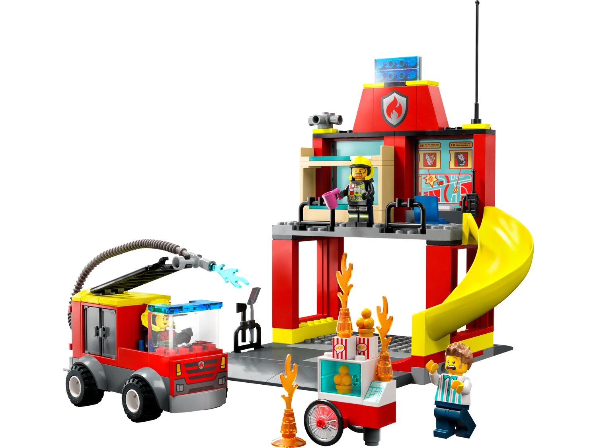
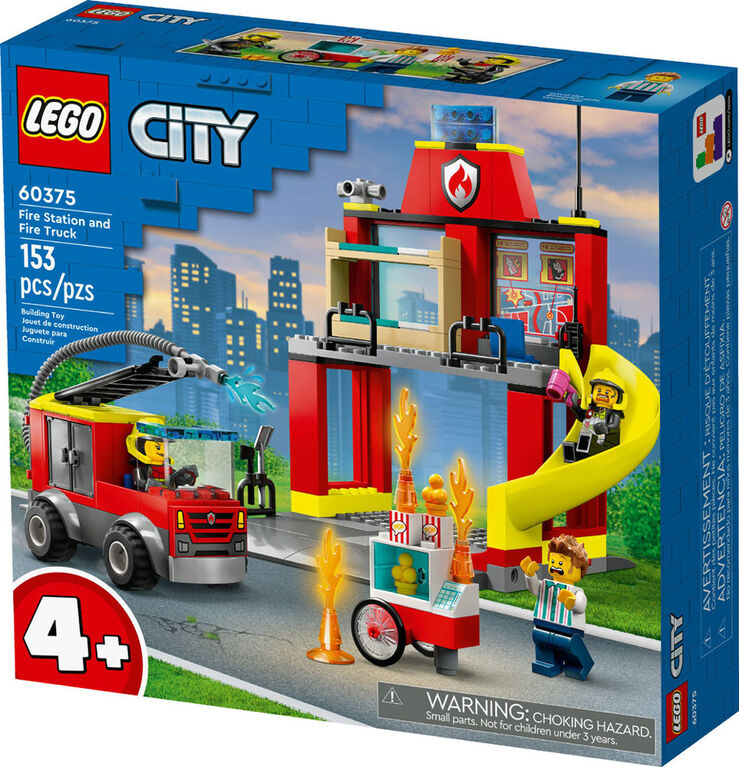
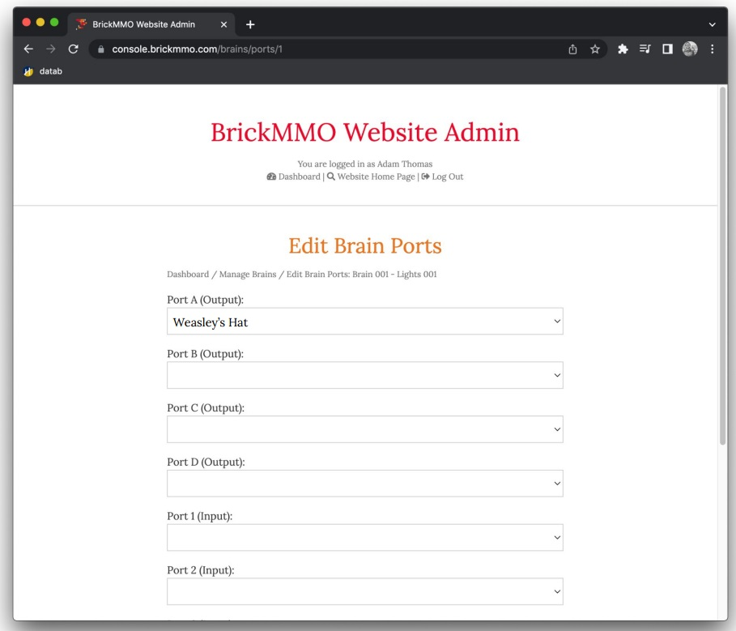
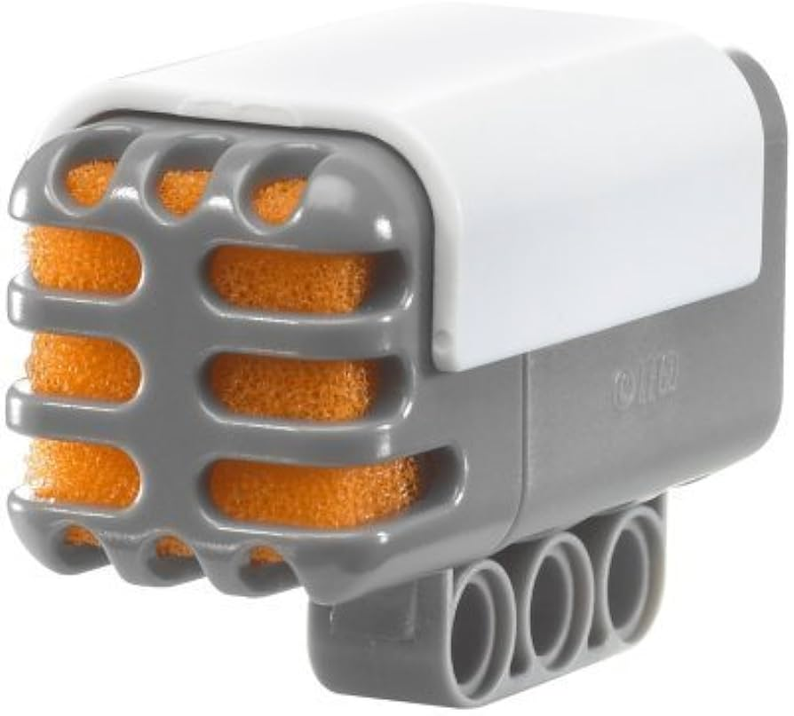
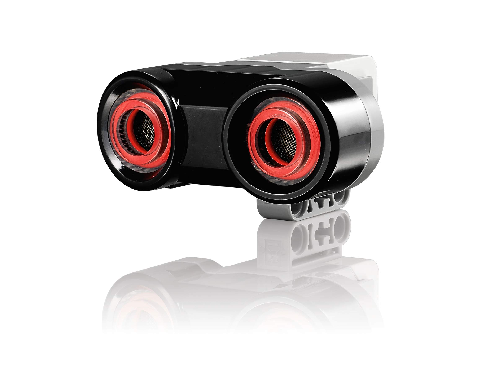
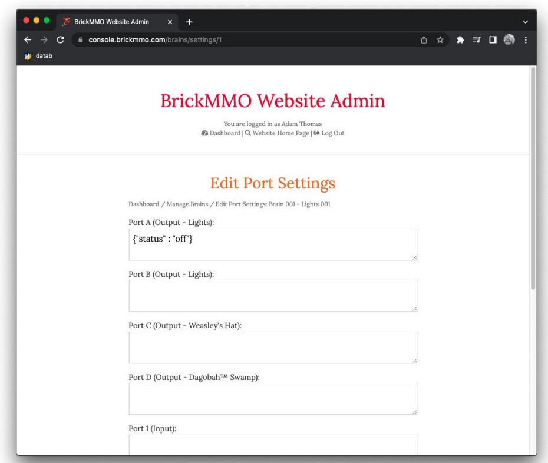

# Firestation 



## Description

The fire station management system is equipped with a fire truck(nozzles, fire extinguishers and ventilators), administration, emergency dispatchers, firefighters and truck drivers, these entities will respond to a fire alarm when triggered within the city. 



## Requirements

* Fire Alarm in every house
* GPS System for navigation
* Map for tracking location



## Sensors and Motors

* Sound Sensor
* Distance Sensor




## Port Settings

* Port is “on” when the alarm is more on for more then 1 minute otherwise its “off”.
* Output port will be the Fire station from where the truck will go to destination.



## Pseudocode

```Pseudocode
var map = map of the lego city
var emergencyLocation = null;

emergency = false;

IF fireAlarmRings > 1 minute 
emergency == true
emergencyLocation = building on fire location

function goToLocation(emergencyLocation)
{
 use the map and the emergencyLocation to get the route for the firestruck
 }

IF firestruck == available 
goToLocation() 
emergency = false

ELSE
wait for firestruck to be available

ELSE emergency is false

ENDIF


