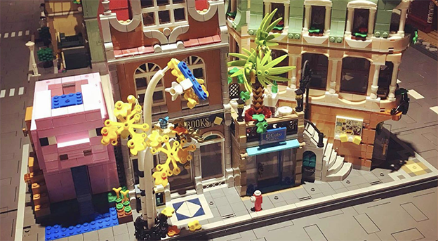
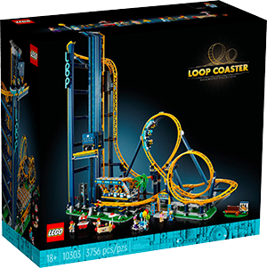

# LEGO® Set Hackathon

For this task you will be working in groups. Your groups have been set randomly in [Blackboard](https://learn.humber.ca).

The [BrickMMO](http://brickmmo.com/) smart city built with LEGO® bricks has many official LEGO kits integrated into the city.

As the city grows we will integrate more and more sets into the smart city. We would like to integrate a varity of interactive components. In this task you will choose an official LEGO set and design an interactive component.

You will not be building and coding the interactive component. This is only a brainstorming session. Your concept may be completed by another groups of students in the future.

In the past students have designed the following:

### Loop Coaster

The [Loop Coaster](https://www.lego.com/en-ca/product/loop-coaster-10303) that will run the ride on command:

> LEGO (n.d.). LEGO Loop Coaster. Retrieved August 7, 2023, from [https://www.lego.com/en-ca/product/nano-gauntlet-76223](https://www.lego.com/en-ca/product/nano-gauntlet-76223)

### Infinity Gauntlet

The [Infinity Gauntlet](https://www.lego.com/en-ca/product/nano-gauntlet-76223) that moves fingers and rotate:

> LEGO (n.d.). LEGO Infinity Gauntlet. Retrieved August 7, 2023, from [https://www.lego.com/en-ca/product/nano-gauntlet-76223](https://www.lego.com/en-ca/product/nano-gauntlet-76223)

## Steps

To complete this task, follow these steps:

1. Browse the official [LEGO Store]() and choose a set.

   > You can also se an alternative build:  
   > [https://rebrickable.com/sets/alternates/](https://rebrickable.com/sets/alternates/)

2. Brainstorm how this set can be adjsuted to become interactive.
3. Brainstorm which sensors, motors, and lights will be required to integrate the concept.
4. Document this interactive concept using the Google Docs template.
5. Add your document to the [hackathon](https://github.com/BrickMMO/hackathon-set.git) repo. You will need to fork the repo, add your changes, and submit a pull request.

> There are more instructions in the hackathon repo:  
> [hackathon](https://github.com/BrickMMO/hackathon-set.git)

## Submitting this Task

Once your instructor has merged your pull request, submit a link to your PDF to the **Set Hackathon** assignment in [Blackboard](https://learn.humber.ca/).

[&#10132; Back to Task List](/)

---

