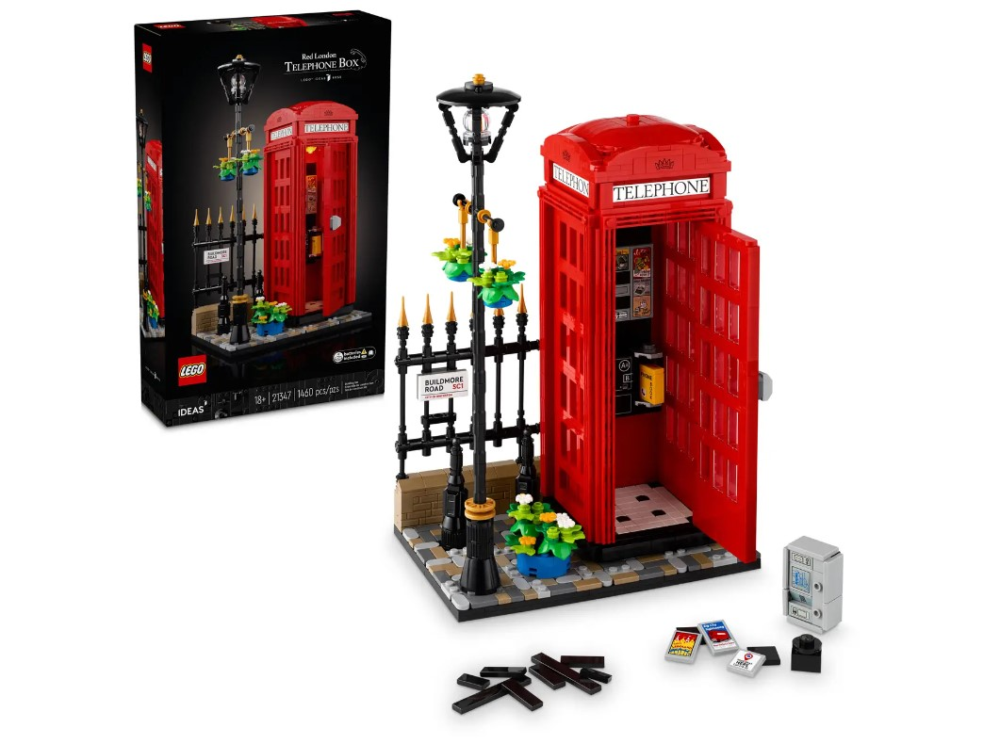
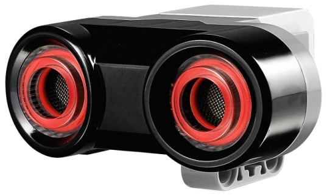
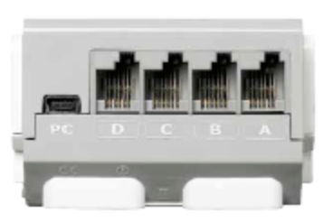
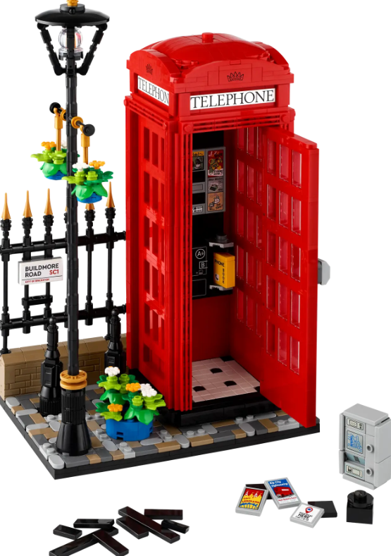

## Red London Telephone Box



> <small>LEGO (n.d.). LEGO Red London Telephone Box. Retrieved February 12, 2024, from [https://www.lego.com/en-ca/product/red-london-telephone-box-21347](https://www.lego.com/en-ca/product/red-london-telephone-box-21347)</small>

### Module Description

A motor will be fixed to the door of the phone booth so that when a car approaches, the door will swing open and a speaker will emit a ringing noise.


> <small>LEGO (n.d.). LEGO 12 Red London Telephone Box Retrieved February 12, 2024, from [https://www.lego.com/en-ca/product/red-london-telephone-box-21347](https://www.lego.com/en-ca/product/red-london-telephone-box-21347)</small>


### Requirements

#### Sensors and Motors

We will be using the Ultrasonic sensor to sense the distance of any passing car.
We will also be using a large motor to open the door and the speaker from EV3 port to play the phone ringing sound.




#### Ports

Our project will require one output port on an EV3 hub to connect a motor as well as one input port to connect the ultrasonic sensor.



### Variables/Settings

Distance: The input given by the sensor.

Limit: The minimum distance required to activate the door and phone.


## Pseudocode

#### IOT Loop

```pseudocode
WHILE TRUE

    IF distance < limit THEN

        door == open
        phone == ring

    ELSE

        door == close
        phone == OFF

    ENDIF

ENDREPEAT
```


<a href="https://brickmmo.com">

</a>
